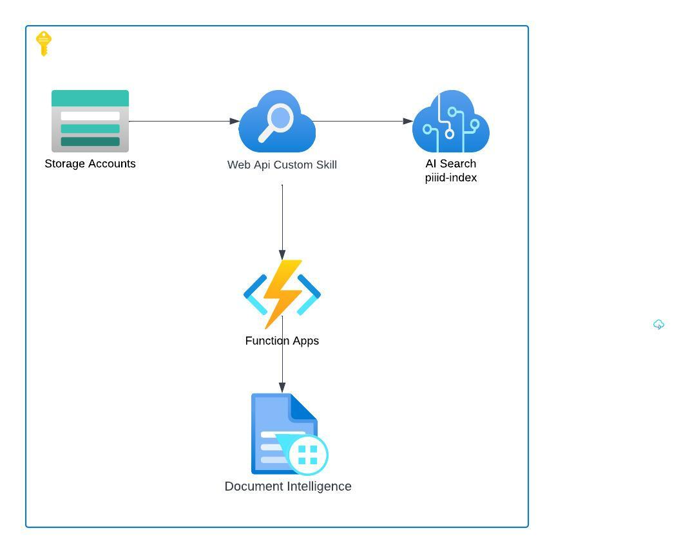

# PII Document Detection

1. [Overview](#overview)
1. [GitHub workflow setup](#github-workflow-setup)
1. [Monitoring](#monitoring)
1. [Useful Links](#useful-links)

### Overview
dd
The solution allows for images (even contained within zip files) to be imported into an Azure AI Search index, while having a custom skill analyze the image to determine whether the image is an ID document, etc., and if so, reads details from the document and populates the index with the enhanced information. 

I found the standard PII pre-built skill wasn't picking up the detail I was after, and hence why I opted to try using Azure Document Intelligence to get to that additional info I was after.

This is a possible option for detecting PII data within a dataset (in this case, files stored in an Azure Blob container).



### GitHub workflow setup
* Create the Service Principal that the GitHub build agent will use to provision resources within Azure using Bicep
```
az login --tenant dca5775e-99b4-497c-90c1-c8e73396999e
az ad sp create-for-rbac --json-auth --name PiiDocDetect --role owner --scopes /subscriptions/761399c5-3790-4380-b6a8-a11554fafa7a
```

### Monitoring
* Query logs
```
union traces, exceptions | where timestamp > ago(5min) and cloud_RoleName == "func-piiid-prd"
```

### Useful Links
1. [How to create index, skillset, indexer and datasource in Azure AI Search](https://learn.microsoft.com/en-us/azure/search/cognitive-search-tutorial-blob)

